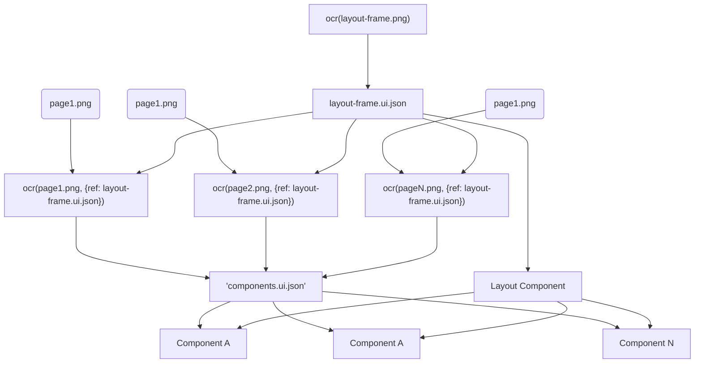

# UI Design to Code Generation (D2C)

<IMPORTANT>
- Set default language to Chinese/中文
- If component code generation and component.ui.json involved in conversation. ALWAYS update it's ui.json after code generation/modification!
</IMPORTANT>

## Workflow Overview


## Semi Design

Here is the Semi Design categories and compoennts:

1. Basic (Foundation Components)
  + Layout, Grid, Button, Typography, Icon, Space, etc.
2. Plus (Enhanced Components)
  + Chat, CodeHighlight, Markdown Render, JsonViewer, etc.
3. Input (Form & Input Components)
  + AutoComplete, Form, Input, Select, DatePicker, Upload, etc.
4. Navigation (Navigation Components)
  + Anchor, Breadcrumb, Navigation, Pagination, Steps, Tabs, Tree
5. Show (Display Components)
  + Avatar, Card, Table, Modal, Popover, Image, Calendar, etc.
6. Feedback (User Feedback Components)
  + Banner, Notification, Toast, Progress, Skeleton, Spin

For details see [Semi Design Intro](./semi-design.md)

Generating Rules
1. **Using existing components from Semi Design where ever possible**
2. **Avoid naming conflict with Semi Design**
3. **Avoid inline styling when comp.tsx has an acompany style file**

# Intrinsic functions Extension

**See what is Intrinsic function at `.roo/rules/rules.md` at the end**

## `ocr(imgPath, options, uiJsonPath?)`
- options.ref: A reference UI component tree JSON containing already recognized high-confidence components.If there are similar structure you should generate the same components.
- options.style: is generating style(espeically color) in props
- options.prd: PRD markdown file describe UI image

```ts
function ocr(imgPath: string, options: {style: boolean, ref?: string, prd?: string}) {
  // Write .ui.json beside <image-name>.png
  const outputJsonPath = getOutpuJsonPath(imgPath);
  if (options.ref === outputJsonPath) {
    // Updating existing UI JSON, keey the whole structure stable only update changed parts
    // Reuse component config if confidence is 100 or impl is true or src is set
  } else {
    // Create UI JSON
  }
}
```

### **Identify Layout Type**
1. Identify the type of the application/page and choose appropriate layout name from [Layouts](./layouts.md)
2. The layout should be flexiable when user agent resized. Elements should expand to fill the container and avoid horizontal visible scrollbar
3. Identify the components need to be implemented and components can import from Semi Design
4. Identify icons can be imported from Semi Design. Availabe [Icons]($.llmstxt/semi-design/icons.md)
  - You may use `lucide-icons` MCP to search best icons with `fuzzy_search_icons` or `search_icons`
5. Record neccessary props sufficient to implement React component. Especially layout and size information.

Recognize given image and output a `UI Component Tree JSON` (default name: .ui.json) which MUST strictly adhere to the following JSON Schema:

```json
{
  "$schema": "http://json-schema.org/draft-07/schema#",
  "title": "UI Component Tree Schema with Identity",
  "description": "A schema for defining a hierarchical UI structure with stable component identification.",
  "type": "object",
  "properties": {
    "schemaVersion": { "type": "string" },
    "design": { "type": "string" },
    "status": {
      "enum": ["editable", "readonly"],
      "description": "Editing a readonly file need the permission from user"
    },
    "abstract": {
      "type": "string",
      "description": "A breif description of the UI. Focus on UI layout"
    },
    "root": { "$ref": "#/$defs/uiComponent" }
  },
  "required": ["schemaVersion", "design", "root"],
  "$defs": {
    "uiComponent": {
      "title": "UI Component",
      "type": "object",
      "frozen": {
        "type": "boolean",
        "description": "Stable component can be freezed to avoid changed by AI agents"
      },
      "properties": {
        "isLayout": {
          "type": "boolean",
          "description": "Indicate this is a web page layout or a component"
        },
        "layoutType": {
          "type": "array",
          "description": "Identified layout types. Can be an array of compitable layout types",
          "items": "string"
        },
        "impl": {
          "type": "boolean",
          "description": "Create a custom component only if this field set to true"
        },
        "src": {
          "type": "string",
          "description": "relative path of source code"
        },
        "ocrImg": {
          "type": "string",
          "description": "OCR image path",
        },
        "confidence": {
          "type": "number",
          "description": "A confidence score between 0 and 100, indicating the model's certainty in this component's identity. Can be manually set"
        },
        "hint": {
          "type": "string",
          "description": "Hints for implementation this component"
        },
        "component": {
          "description": "A descriptive, but potentially inconsistent, name for the component.",
          "type": "string"
        },
        "identity": {
          "description": "A stable, unique fingerprint for identifying and grouping this component.",
          "type": "object",
          "properties": {
            "category": {
              "description": "The broad classification of the component (e.g., 'Button', 'Input').",
              "type": "string"
            },
            "variant": {
              "description": "The specific stylistic or functional variation (e.g., 'primary', 'search').",
              "type": "string"
            },
            "structure": {
              "description": "The internal composition of the component (e.g., ['icon', 'text']).",
              "type": "array",
              "items": { "type": "string" }
            }
          },
          "required": ["category", "variant"]
        },
        "props": {
          "description": "An object containing the properties (props) for the component.",
          "type": "object",
          "additionalProperties": true
        },
        "children": {
          "description": "An array of nested child UI components.",
          "type": "array",
          "items": { "$ref": "#/$defs/uiComponent" }
        }
      },
      "required": ["component", "identity"]
    }
  }
}
```

### **CRITICAL INSTRUCTIONS for the `identity` object:**

Your primary goal is to generate a **stable and consistent `identity`** for every component.
Base your decisions on the component's function and visual style, not its specific text content.
Avoid create components that already exists in Semi-Design

1. **`category`**: You MUST use one of the [Semi Design](./semi-design.md) category names
2. **`variant`**: Describe the component's role within its category. Use consistent, simple terms.
3. **`structure`**: If the component is a composite of basic elements, list them in order of appearance. Use these terms: `icon`, `text`, `avatar`, `input`, `title`, `subtitle`.
    * *Example*: A button with a search icon on the left and the word "Search" is `["icon", "text"]` .
4. **`size`**: To proper generate code you identify the relative sizes of the components in the image
5. **`color`**: Since will use Semi Desin and customized theme, `colors, font-size, etc` this kind of style props can be


**NAMING CONVENTION for the `component` field:**

The `component` name should be a descriptive, PascalCase combination of its **category and variant**.
If you identified  that the component is/should/can be a Semi Design component, prefix it with 'semi:' like "semi:<comopnent>".
By following these strict rules, you will ensure that the generated JSON is as stable and predictable as possible, even when the UI image is slightly updated.

## `extractCommonComponents()`

```js
extractCommonComponents(jsonTrees, componentsFilePath = `$.mm/components.ui.json`, threshold = 2) {
    // Output `$.mm/components.ui.json`
}
```

Output a `$.mm/components.ui.json` with conform to following schema:

```json
{
  "$schema": "http://json-schema.org/draft-07/schema#",
  "title": "UI Common Components Schema",
  "description": "A schema for a file that accumulates definitions of common UI components extracted from multiple sources over time.",
  "type": "object",
  "properties": {
    "schemaVersion": {
      "description": "The version of this schema.",
      "type": "string"
    },
    "components": {
      "description": "A map where each key is a stringified 'identity' object and the value is the component definition.",
      "type": "object",
      "additionalProperties": {
        "$ref": "#/$defs/commonComponentDefinition"
      }
    }
  },
  "required": ["components"],
  "$defs": {
    "commonComponentDefinition": {
      "type": "object",
      "properties": {
        "identity": {
          "description": "The parsed identity object that defines this component.",
          "type": "object",
          "properties": {
            "category": { "type": "string" },
            "variant": { "type": "string" },
            "structure": { "type": "array", "items": { "type": "string" } }
          },
          "required": ["category", "variant"]
        },
        "canonicalName": {
          "description": "The most common or representative name for this component (e.g., 'PrimaryButton').",
          "type": "string"
        },
        "count": {
          "description": "Total number of times this component has been observed across all extraction runs.",
          "type": "integer",
          "minimum": 1
        },
        "createdAt": {
          "description": "ISO 8601 timestamp of when this component was first identified.",
          "type": "string",
          "format": "date-time"
        },
        "updatedAt": {
          "description": "ISO 8601 timestamp of the last time this component was observed.",
          "type": "string",
          "format": "date-time"
        }
      },
      "required": ["identity", "canonicalName", "count", "createdAt", "updatedAt"]
    }
  }
}
```

### Algorithm for Stable Common Component Extraction

This algorithm is designed to be resilient to small changes and slight variations across multiple UI images.
Its stability comes from grouping components by their immutable `identity` object and using a frequency threshold to filter out noise.

The algorithm identifies common components by finding which `identity` "fingerprints" appear most often across all your JSON files.

⚙️ **The init Algorithm:**

1.  **Initialize a Component Map**: Create an empty hash map (or dictionary) called `componentMap`.
  * The **key** of the map will be a stringified version of the `identity` object.
  * The **value** will be an object containing a `count` and a list of all `instances` of that component.

2.  **Traverse All JSON Trees**: For each UI component tree JSON file you have:
  * Perform a recursive traversal (like a Depth-First Search) starting from the `root` node.
  * For every component node you visit, do the following:
    * **Generate an ID Key**: Create a stable string key from the component's `identity` object. A simple JSON.stringify on a sorted `identity` object works perfectly. `(e.g., '{"category":"Button","variant":"secondary","structure":["text"]}')`
    * **Group the Component**:
      * If this `idKey` is not in the `componentMap`, add it. Initialize its value to `{ count: 1, instances: [componentNode] }`.
      * If the `idKey` already exists, increment its `count` and add the current `componentNode` to its `instances` list.

3.  **Filter for Common Components**:
  * Define a `MIN_OCCURRENCE_THRESHOLD` (e.g., 3). A component must appear at least this many times to be considered "common".
  * Create an empty list called `commonComponents`.
  * Iterate through the `componentMap`. If any entry has a `count` greater than or equal to `MIN_OCCURRENCE_THRESHOLD`, add its data (the identity, the count, and the list of instances) to the `commonComponents` list.

4.  **Define Canonical Components (Optional but Recommended)**:

  * For each entry in the `commonComponents` list, analyze the `instances` to create a "master" or "canonical" version.
  * The `identity` is already the same.
  * The `component` name can be taken from the first instance.
  * For the `props`, create a base version containing only the properties that are identical across all instances. Properties that vary (like `text` content or a specific `onClick` handler) are what become the props of your final React component.

```js
function initCommonComponents(jsonTrees, threshold = 2) {
  const componentMap = new Map();

  // Step 1 & 2: Traverse and Group
  for (const tree of jsonTrees) {
    traverse(tree.root, (component) => {
      if (!component.identity) return;

      const idKey = JSON.stringify(sortObjectKeys(component.identity));

      if (!componentMap.has(idKey)) {
        componentMap.set(idKey, {
          count: 0,
          instances: []
        });
      }
      const entry = componentMap.get(idKey);
      entry.count++;
      entry.instances.push(component);
    });
  }

  // Step 3: Filter
  const commonComponents = [];
  for (const [idKey, data] of componentMap.entries()) {
    if (data.count >= threshold) {
      // Step 4 (optional): Add logic here to define a canonical representation
      // from the data.instances array.
      commonComponents.push({
        identity: JSON.parse(idKey),
        count: data.count,
        canonicalName: data.instances[0].component,
        // ... add canonical props definition here ...
      });
    }
  }

  return commonComponents;
}
```

⚙️ **The update Algorithm:**

1.  **Load Existing Components**:
  * Read and parse the `$.mm/components.ui.json` file. If it doesn't exist or is invalid, start with an empty object, e.g., `{ "components": {} }`. This is your **`masterComponentMap`**.

2.  **Analyze New Sources**:
  * Create a temporary **`newlyFoundMap`** for the new batch of JSON trees you are processing.
  * Traverse all the new trees and populate `newlyFoundMap` exactly as in the previous algorithm (group by stringified `identity`, count occurrences, and store instances).

3.  **Merge and Accumulate**:
  * Get the current timestamp (`now = new Date().toISOString()`).
  * Iterate through each component (`idKey`, `data`) in your `newlyFoundMap`.
  * Check if the `idKey` already exists in `masterComponentMap.components`:
    * **If YES (Update Existing Component)**:
      * Increment the existing `count` by `data.count`.
      * Update the `updatedAt` timestamp to `now`.
      * *(Optional: You can add logic here to merge source file lists or refine the `canonicalName`)*.
    * **If NO (Add New Component)**:
      * Check if `data.count` meets your `MIN_OCCURRENCE_THRESHOLD`.
      * If it does, create a new entry in `masterComponentMap.components` with the `idKey`.
      * Populate it with:
        * `identity`: Parsed from the first instance.
        * `canonicalName`: From the first instance (e.g., `PrimaryButton`).
        * `count`: Set to `data.count`.
        * `createdAt`: Set to `now`.
        * `updatedAt`: Set to `now`.

4.  **Save Results**:

      * Serialize the updated `masterComponentMap` object back into a well-formatted JSON string.
      * Overwrite the `components.ui.json` file with this new content.

**Pseudocode Example:**

```js
function updateCommonComponents(newJsonTrees, componentsFilePath, threshold) {
  // Step 1: Load existing data
  let masterData = loadJsonFile(componentsFilePath) || {
    schemaVersion: "1.0",
    components: {}
  };

  // Step 2: Analyze new sources
  const newlyFoundMap = new Map();
  for (const tree of newJsonTrees) {
    traverse(tree.root, (component) => {
      if (!component.identity) return;
      const idKey = JSON.stringify(sortObjectKeys(component.identity));

      if (!newlyFoundMap.has(idKey)) {
        newlyFoundMap.set(idKey, {
          count: 0,
          instances: []
        });
      }
      const entry = newlyFoundMap.get(idKey);
      entry.count++;
      entry.instances.push(component);
    });
  }

  // Step 3: Merge and Accumulate
  const now = new Date().toISOString();
  for (const [idKey, newData] of newlyFoundMap.entries()) {
    const existingComponent = masterData.components[idKey];

    if (existingComponent) {
      // Update existing
      existingComponent.count += newData.count;
      existingComponent.updatedAt = now;
    } else if (newData.count >= threshold) {
      // Add new
      const firstInstance = newData.instances[0];
      masterData.components[idKey] = {
        identity: firstInstance.identity,
        canonicalName: firstInstance.component,
        count: newData.count,
        createdAt: now,
        updatedAt: now,
      };
    }
  }

  // Step 4: Save results
  saveJsonFile(componentsFilePath, masterData);

  return masterData;
}
```

## `extractComponent(uiJsonPath, ...names)`

Extract custom components from given <page>.ui.json to `components.ui.json`

**Component Definition:**

```json
{
 "identity": {
   "category": "${identity.category}",
   "variant": "${identity.variant}",
   "structure": ${JSON.stringify(identity.structure || [])}
 },
 "canonicalName": "${canonicalName}"
}
```

**CRITICAL INSTRUCTIONS:**

1.  **File `index.tsx`:**
  + Create a functional React component named `${canonicalName}` .
  + Import React and the corresponding SCSS file: `import './index.scss';` .
  + Define a `Props` interface. Infer the props from the `identity.structure` .
    - If `structure` contains `"text"` , the component should accept `children: React.ReactNode` .
    - If `structure` contains `"icon"` , add an `icon?: React.ReactNode` prop.
    - If `structure` contains `"avatar"` , add an `avatarUrl?: string` prop.
    - Always include standard HTML attributes by extending `React.HTMLAttributes<HTMLDivElement>` .
  + Use the `canonicalName` as the BEM block class for the root element (e.g.,  `<div className="${canonicalName}">` ).
  + Render the props in the JSX, using BEM for child elements (e.g.,  `<div className="${canonicalName}__icon">{icon}</div>` ).

2.  **File `index.scss`:**
  + Use SCSS with the BEM methodology.
  + The root selector MUST match the `canonicalName` (e.g.,  `.${canonicalName} { ... }` ).
  + Provide sensible, modern-looking default styles. Add placeholders for colors and fonts (e.g.,  `color: var(--text-primary);` ).
  + Style any child elements defined by the `structure` (e.g.,  `&__icon { ... }` ).

## `implComponents(name.ui.json, output)`

```ts
function implComponents(uiJsonFilePath, outputDirOrFile) {
  // Ensure directory outputDir is exists
  // Infer component Props interface
  // Identify component state, event, effects, refs, etc
  // Consider the DOM structure according to UI JSON tree
  // Implement or update component code and style
  // Review import statements for duplicated importing
  // Review imported icon are available. use MCP search_icons for a best match
}
```

**EXAMPLE OUTPUT FORMAT:**

```tsx
import { Icon, ... } from '@douyinfe/semi-ui';
function CustomIcon() {
  return <Icon svg={...} />;
}
```

Do not add any explanations. Provide the raw code for each file separated by a unique delimiter.

```ts
import React, { useState } from 'react';
import { ... } from '@douyinfe/semi-icons';
import './index.scss';

export interface Props extends React.HTMLAttributes<HTMLDivElement> {
// ... inferred props here ...
}

export const ${canonicalName}: React.FC<Props> = ({ ...props }) => {
  // State management
  // Event handlers
  // Data sources
  return (
    <div className="${canonicalName}" {...props}>
      {/* DOM */}
    </div>
  );
};
```

```scss
.${canonicalName} {
/* Base styles */
}
```

# Popular Web Page Layouts
---

### 1. **Sidebar + Topbar Layout (Left Navigation Layout)** (sidebar-topbar-layout)

**Description:** Fixed left sidebar with navigation links and a top bar with search/settings. Main content area on the right.

```
+------------------------------------------------------+
| Topbar (Search / Profile / Settings)                 |
+------+-----------------------------------------------+
|Side  | Main Content Area                             |
|bar   |                                               |
+------+-----------------------------------------------+
```

---

### 2. **Collapsed Sidebar (Mini Sidebar) Layout** (collapsed-sidebar-layout)

**Description:** A very narrow sidebar showing only icons, expanding on hover/click.

```
+------------------------------------------------------+
| Topbar                                               |
+--+---------------------------------------------------+
|I | Main Content Area                                 |
|C |                                                   |
+--+---------------------------------------------------+
```

(`I` = Icons)

---

### 3. **Top Navigation Layout (Header Nav)** (top-navigation-layout)

**Description:** All navigation links placed in a horizontal bar at the top.

```
+------------------------------------------------------+
| Top Navigation (Links)                               |
+------------------------------------------------------+
| Main Content Area                                    |
|                                                      |
+------------------------------------------------------+
```

---

### 4. **Sidebar with Secondary Panel Layout (Dual Sidebar)** (dual-sidebar-layout)

**Description:** Primary sidebar plus secondary sidebar for sub-navigation or filters.

```
+------------------------------------------------------+
| Topbar                                               |
+---+---+----------------------------------------------+
|Nav|Sub| Main Content                                 |
|   |Bar|                                              |
+---+---+----------------------------------------------+
```

---

### 5. **Split-Screen Layout (Dual Panel)** (split-screen-layout)

**Description:** Two main panels side-by-side, often list + details.

```
+------------------------------------------------------+
| Topbar                                               |
+---------------------+-------------------------------+
| Panel A             | Panel B                       |
| (List)              | (Details)                     |
+---------------------+-------------------------------+
```

---

### 6. **Tabbed Dashboard Layout** (tabbed-dashboard-layout)

**Description:** Tabs across the top of main content area.

```
+------------------------------------------------------+
| Topbar                                               |
+------------------------------------------------------+
| Tabs: [A] [B] [C]                                    |
+------------------------------------------------------+
| Content for selected tab                             |
+------------------------------------------------------+
```

---

### 7. **Modular Card/Grid Dashboard Layout** (modular-card-grid-dashboard-layout)

**Description:** Dashboard made up of cards or widgets arranged in a grid.

```
+------------------------------------------------------+
| Topbar                                               |
+------------------------------------------------------+
| [Card1] [Card2] [Card3]                              |
| [Card4] [Card5] [Card6]                              |
+------------------------------------------------------+
```

---

### 8. **Kanban / Board Layout** (kanban-board-layout)

**Description:** Columns representing stages; cards move between them.

```
+------------------------------------------------------+
| Topbar                                               |
+--------+--------+--------+                           +
|Col 1   |Col 2   |Col 3   |                           |
|[Card]  |[Card]  |[Card]  |                           |
+--------+--------+--------+                           +
```

---

### 9. **Master–Detail (Inspector) Layout** (master-detail-layout)

**Description:** List/table on one side; details or editor on the other.

```
+------------------------------------------------------+
| Topbar                                               |
+-----------+------------------------------------------+
| Item List | Item Details                             |
|           |                                          |
+-----------+------------------------------------------+
```

---

### 10. **App Shell Layout** (app-shell-layout)

**Description:** Fixed shell (header + nav) loaded once, content swapped dynamically.

```
+------------------------------------------------------+
| Header (Nav / Branding / User)                       |
+------+-----------------------------------------------+
|NavBar| Content Shell (dynamic)                       |
+------+-----------------------------------------------+
```

---

### 11. **Off-Canvas Sidebar Layout** (off-canvas-sidebar-layout)

**Description:** Sidebar hidden by default, slides in on toggle.

```
+------------------------------------------------------+
| Topbar with ☰ Menu Icon                              |
+------------------------------------------------------+
| Main Content (Sidebar slides over on demand)         |
+------------------------------------------------------+
```

---

### 12. **Multi-Level Sidebar Layout** (multi-level-sidebar-layout)

**Description:** Sidebar supports nested menus.

```
+------------------------------------------------------+
| Topbar                                               |
+----------------+-------------------------------------+
| Sidebar         | Main Content                       |
| - Menu1         |                                     |
|   - Sub1        |                                     |
|   - Sub2        |                                     |
+----------------+-------------------------------------+
```

---

### 13. **Sticky Footer Admin Layout** (sticky-footer-admin-layout)

**Description:** Persistent bottom bar for controls or status.

```
+------------------------------------------------------+
| Topbar                                               |
+------------------------------------------------------+
| Content Area                                         |
|                                                      |
+------------------------------------------------------+
| Footer (Actions/Status)                              |
+------------------------------------------------------+
```

---

### 14. **Full-Screen Layout (No Nav)** (full-screen-layout)

**Description:** Only the content area; navigation hidden elsewhere.

```
+------------------------------------------------------+
| Full-Screen Content Area                             |
| (Charts / Data / Canvas)                             |
+------------------------------------------------------+
```

---

### 15. **Widgetized Homepage Layout** (widgetized-homepage-layout)

**Description:** Drag-and-drop widgets arranged in grid.

```
+------------------------------------------------------+
| Topbar                                               |
+------------------------------------------------------+
| [Widget] [Widget] [Widget]                           |
| [Widget] [Widget] [Widget]                           |
+------------------------------------------------------+
```

---

### 16. **Step/Workflow Layout** (step-workflow-layout)

**Description:** Horizontal progress steps above content.

```
+------------------------------------------------------+
| Steps: 1 -> 2 -> 3                                   |
+------------------------------------------------------+
| Step Content                                         |
+------------------------------------------------------+
```

---

### 17. **Vertical Tabs Layout** (vertical-tabs-layout)

**Description:** Tabs arranged vertically on left, content on right.

```
+------------------------------------------------------+
| Topbar                                               |
+-----+-----------------------------------------------+
|Tabs | Content                                       |
|     |                                               |
+-----+-----------------------------------------------+
```

---

### 18. **Split Header Layout** (split-header-layout)

**Description:** Header divided into two rows or sections.

```
+------------------------------------------------------+
| Header Top (Brand/User)                              |
+------------------------------------------------------+
| Header Bottom (Nav / Search)                         |
+------------------------------------------------------+
| Main Content                                         |
+------------------------------------------------------+
```

---

### 19. **Responsive Dashboard Layout** (responsive-dashboard-layout)

**Description:** Automatically adapts between sidebar+topbar and mobile view.

```
Desktop:
+------+-----------------------------------------------+
|NavBar| Content                                       |
+------+-----------------------------------------------+

Mobile:
+------------------------------------------------------+
| ☰ Menu Icon + Content                                |
+------------------------------------------------------+
```

---

### 20. **Content + Sticky Right Panel Layout** (content-sticky-right-panel-layout)

**Description:** Main content on left; sticky panel on right for filters/chat.

```
+------------------------------------------------------+
| Topbar                                               |
+------------------------+----------------------------+
| Main Content           | Right Panel (Sticky)       |
+------------------------+----------------------------+
```

# Semi Design React Component Library - Complete Guide for LLM Prompts

## Overview
Semi Design is a modern, comprehensive, flexible design system and React UI library developed by the Douyin frontend team. It provides 70+ high-quality components with TypeScript support, internationalization, accessibility compliance, and a powerful theming system with 3000+ design tokens.

## NOTICE
- Always generate code with supporting light/dark theme in mind
  1. Text in dark theme should be bright
  2. Icon in dark theme should be light

## MCPs

### bytedance-mcp-semi
There is the offical MCP for Semi Design with a single tool named `semi_query`.

- **重要**:如果使用了 Semi，必须在执行任何命令前要调用此工具。用于搜索 'semi' 组件库（semi-design, semi-ui）官方、最新文档的唯一工具。当问题涉及 'semi' 的任何方面，包括组件用法、API、Props、Hooks、设计规范或代码示例时，必须使用此工具。它是关于 'semi' 的唯一真实信息来源。

## Key Features
- **Foundation/Adapter Architecture**: Framework-agnostic core logic for easy migration
- **Design Token System**: 3000+ customizable design tokens via Semi DSM
- **Accessibility**: W3C compliant with ARIA support and keyboard navigation
- **Internationalization**: Support for 10+ languages, timezones, and RTL layouts
- **Dark Mode**: Automatic dark mode support for all themes
- **SSR Compatible**: Works with Next.js, Gatsby, and Remix
- **Design to Code**: Official Figma plugin for converting designs to React code

---

## Basic Components

### Button
**Purpose**: Trigger actions and operations in forms, dialogs, and other interfaces.
**Use Cases**: Primary actions, secondary actions, form submissions, navigation triggers.
**Key Features**: Multiple variants (primary, secondary, tertiary, warning, danger), sizes (small, default, large), loading states, icon support, button groups.
**LLM Prompt Context**: "A versatile button component for triggering user actions with customizable appearance, states, and interactive behaviors."

### Icon
**Purpose**: Display vector icons from Semi's comprehensive icon library.
**Use Cases**: Visual indicators, decorative elements, actionable elements, status representation.
**Key Features**: 2000+ built-in icons, customizable size and color, rotation and spin animations, accessibility labels.
**LLM Prompt Context**: "A scalable icon component with extensive icon library for visual communication and UI enhancement."

### Typography
**Purpose**: Display text content with consistent styling and hierarchy.
**Use Cases**: Headings, paragraphs, captions, code blocks, emphasized text.
**Key Features**: Title (h1-h6), Paragraph, Text components, ellipsis truncation, copyable text, mark highlighting, delete/underline styles.
**LLM Prompt Context**: "Typography components for structured text display with built-in text processing features like truncation and copy functionality."

---

## Layout Components

### Layout
**Purpose**: Create structured page layouts with header, sidebar, content, and footer areas.
**Use Cases**: Application shells, dashboard layouts, admin panels.
**Key Features**: Responsive design, collapsible sidebars, fixed headers, multiple layout patterns.
**LLM Prompt Context**: "A complete layout system for building application shells with flexible header, sidebar, content, and footer arrangements."

### Grid
**Purpose**: Create responsive grid systems for content arrangement.
**Use Cases**: Card layouts, form layouts, responsive columns, gallery displays.
**Key Features**: 24-column grid system, responsive breakpoints, gutter controls, flex alignment options.
**LLM Prompt Context**: "A flexible grid system for responsive layouts with precise column control and spacing management."

### Space
**Purpose**: Add consistent spacing between elements.
**Use Cases**: Component spacing, layout gaps, visual separation.
**Key Features**: Multiple spacing sizes, horizontal/vertical direction, automatic wrapping, align controls.
**LLM Prompt Context**: "A spacing utility component for maintaining consistent gaps between UI elements with automatic responsive behavior."

### Divider
**Purpose**: Visually separate content sections.
**Use Cases**: Section breaks, content grouping, visual hierarchy.
**Key Features**: Horizontal/vertical orientation, custom text labels, different line styles.
**LLM Prompt Context**: "A separator component for creating visual breaks between content sections with optional text labels."

---

## Navigation Components

### Navigation
**Purpose**: Primary website/application navigation with hierarchical menu structure.
**Use Cases**: Main navigation, sidebar menus, breadcrumb navigation.
**Key Features**: Multi-level menus, icons, badges, collapsible sections, horizontal/vertical layouts.
**LLM Prompt Context**: "A comprehensive navigation component supporting hierarchical menus with icons, badges, and responsive behavior."

### Breadcrumb
**Purpose**: Show user's current location in the site hierarchy.
**Use Cases**: Page navigation, location indication, hierarchical path display.
**Key Features**: Separator customization, clickable paths, icon support, overflow handling.
**LLM Prompt Context**: "A breadcrumb navigation component for displaying hierarchical page paths with customizable separators and overflow management."

### Steps
**Purpose**: Display progress through a multi-step process.
**Use Cases**: Multi-step forms, progress indication, process visualization.
**Key Features**: Horizontal/vertical orientation, custom icons, status states (wait, process, finish, error), click navigation.
**LLM Prompt Context**: "A step-by-step progress indicator for guiding users through multi-stage processes with status visualization."

### Tabs
**Purpose**: Organize content into multiple panels accessible via tabs.
**Use Cases**: Content organization, settings panels, data views.
**Key Features**: Multiple tab types, closable tabs, tab positions (top, bottom, left, right), lazy loading, excess tabs handling.
**LLM Prompt Context**: "A tabbed interface component for organizing related content into separate views with extensive customization options."

### Pagination
**Purpose**: Navigate through large datasets across multiple pages.
**Use Cases**: Table pagination, search results, content lists.
**Key Features**: Page size selection, quick jumper, total count display, simple mode, responsive behavior.
**LLM Prompt Context**: "A pagination component for navigating large datasets with page size controls and responsive behavior."

### Anchor
**Purpose**: Create anchor links for page section navigation.
**Use Cases**: Table of contents, page navigation, documentation links.
**Key Features**: Automatic active state, smooth scrolling, offset controls, custom target elements.
**LLM Prompt Context**: "An anchor navigation component for creating table of contents and smooth scrolling page section navigation."

---

## Data Entry Components

### Form
**Purpose**: Comprehensive form management with validation and layout.
**Use Cases**: User registration, data collection, settings forms, surveys.
**Key Features**: Field validation, form layout controls, error handling, API integration, nested forms, field dependencies.
**LLM Prompt Context**: "A powerful form management system with built-in validation, error handling, and flexible layout options for complex data collection."

### Input
**Purpose**: Single-line text input with various input types.
**Use Cases**: Text entry, search fields, numeric input, password fields.
**Key Features**: Input types (text, password, search), prefix/suffix elements, clear button, character counting, validation states.
**LLM Prompt Context**: "A versatile input component supporting various input types with prefix/suffix elements and built-in validation states."

### InputNumber
**Purpose**: Numeric input with increment/decrement controls.
**Use Cases**: Quantity selection, numeric settings, measurement input.
**Key Features**: Min/max limits, step controls, precision settings, formatter functions, keyboard shortcuts.
**LLM Prompt Context**: "A numeric input component with stepper controls, range validation, and custom formatting for precise number entry."

### TextArea
**Purpose**: Multi-line text input for longer content.
**Use Cases**: Comments, descriptions, long-form text entry, code input.
**Key Features**: Auto-resize, character counting, row controls, validation states, clear functionality.
**LLM Prompt Context**: "A multi-line text input component with auto-resize capabilities and character counting for extended text entry."

### Select
**Purpose**: Dropdown selection from predefined options.
**Use Cases**: Option selection, category choosing, filter controls.
**Key Features**: Single/multiple selection, search filtering, option groups, remote data loading, custom rendering, virtual scrolling.
**LLM Prompt Context**: "A flexible dropdown selection component with search, grouping, and virtual scrolling for efficient option selection."

### TreeSelect
**Purpose**: Hierarchical selection from tree-structured data.
**Use Cases**: Category selection, organizational structures, nested option selection.
**Key Features**: Single/multiple selection, search filtering, checkable nodes, lazy loading, custom node rendering.
**LLM Prompt Context**: "A tree-structured selection component for hierarchical data with search and lazy loading capabilities."

### Cascader
**Purpose**: Multi-level cascading selection for related options.
**Use Cases**: Location selection, category hierarchies, related option chains.
**Key Features**: Dynamic loading, search functionality, multiple selection, custom display, separator customization.
**LLM Prompt Context**: "A cascading selection component for multi-level related options with dynamic loading and search capabilities."

### DatePicker
**Purpose**: Date and time selection with calendar interface.
**Use Cases**: Event scheduling, date filtering, appointment booking.
**Key Features**: Date ranges, time selection, multiple formats, localization, disabled dates, preset ranges.
**LLM Prompt Context**: "A comprehensive date and time picker with calendar interface, range selection, and extensive localization support."

### TimePicker
**Purpose**: Time selection with hour, minute, and second precision.
**Use Cases**: Scheduling, time settings, duration input.
**Key Features**: 12/24 hour formats, step controls, range selection, input validation, keyboard navigation.
**LLM Prompt Context**: "A time selection component with flexible format support and precise time input controls."

### Switch
**Purpose**: Binary toggle control for on/off states.
**Use Cases**: Settings toggles, feature enabling, boolean controls.
**Key Features**: Custom labels, sizes, loading states, disabled states, checked value customization.
**LLM Prompt Context**: "A switch toggle component for binary state control with customizable appearance and loading states."

### Radio
**Purpose**: Single selection from mutually exclusive options.
**Use Cases**: Single choice questions, option selection, settings.
**Key Features**: Radio groups, custom styling, vertical/horizontal layout, disabled options.
**LLM Prompt Context**: "A radio button component for mutually exclusive single selection with flexible layout and styling options."

### Checkbox
**Purpose**: Multiple selection or boolean input control.
**Use Cases**: Multi-selection, agreement checkboxes, feature toggles.
**Key Features**: Indeterminate state, checkbox groups, custom styling, disabled states.
**LLM Prompt Context**: "A checkbox component for multiple selection and boolean input with indeterminate state support."

### Rating
**Purpose**: Star-based rating input and display.
**Use Cases**: Product ratings, feedback collection, quality assessment.
**Key Features**: Custom icons, half-star support, read-only mode, hover effects, character-based rating.
**LLM Prompt Context**: "A star rating component for collecting and displaying ratings with customizable icons and interaction states."

### Slider
**Purpose**: Range selection via draggable slider interface.
**Use Cases**: Volume controls, price ranges, settings adjustment.
**Key Features**: Single/range values, marks and labels, vertical orientation, tooltip display, step controls.
**LLM Prompt Context**: "A slider component for range selection with marks, tooltips, and flexible orientation for intuitive value adjustment."

### Upload
**Purpose**: File upload with drag-and-drop and progress tracking.
**Use Cases**: File attachments, image uploads, document submission.
**Key Features**: Drag-and-drop, progress tracking, file type validation, preview generation, multiple files.
**LLM Prompt Context**: "A file upload component with drag-and-drop interface, progress tracking, and extensive file handling capabilities."

### Transfer
**Purpose**: Move items between two lists with selection controls.
**Use Cases**: Permission assignment, item categorization, data migration.
**Key Features**: Search filtering, custom rendering, pagination, selection controls, drag-and-drop.
**LLM Prompt Context**: "A dual-list transfer component for moving items between lists with search and selection capabilities."

### AutoComplete
**Purpose**: Input with automatic suggestion dropdown.
**Use Cases**: Search inputs, data entry assistance, smart completion.
**Key Features**: Custom data sources, debounced searching, custom rendering, keyboard navigation, loading states.
**LLM Prompt Context**: "An auto-complete input component with customizable data sources and intelligent suggestion matching."

---

## Data Display Components

### Table
**Purpose**: Display structured data in rows and columns with sorting and filtering.
**Use Cases**: Data grids, lists, reports, dashboards.
**Key Features**: Sorting, filtering, pagination, row selection, expandable rows, fixed columns, virtual scrolling, custom cell rendering.
**LLM Prompt Context**: "A powerful data table component with sorting, filtering, pagination, and virtual scrolling for large datasets."

### List
**Purpose**: Display a series of items in a vertical layout.
**Use Cases**: Content lists, menu items, search results.
**Key Features**: Item actions, loading states, infinite scroll, custom item rendering, grid layout option.
**LLM Prompt Context**: "A flexible list component for displaying series of items with actions, loading states, and infinite scroll support."

### Descriptions
**Purpose**: Display key-value pairs in a structured format.
**Use Cases**: Detail pages, specifications, metadata display.
**Key Features**: Responsive layout, custom labels, bordered style, copy functionality, nested descriptions.
**LLM Prompt Context**: "A descriptions component for displaying structured key-value information with responsive layout and copy functionality."

### Card
**Purpose**: Flexible content container with header, body, and footer sections.
**Use Cases**: Content previews, dashboards, information grouping.
**Key Features**: Header/footer sections, action buttons, loading states, hover effects, shadow controls.
**LLM Prompt Context**: "A versatile card container component for grouping related content with headers, actions, and various display options."

### Avatar
**Purpose**: Display user profiles, images, or placeholder icons.
**Use Cases**: User identification, profile displays, contact lists.
**Key Features**: Image/text/icon content, size variants, shape options (circle, square), badge support, group avatars.
**LLM Prompt Context**: "An avatar component for user representation with support for images, text, icons, and badge indicators."

### Badge
**Purpose**: Small status indicators and notification counters.
**Use Cases**: Notification counts, status indicators, labels.
**Key Features**: Number badges, dot indicators, custom content, position controls, overflow handling.
**LLM Prompt Context**: "A badge component for status indication and notification counts with flexible positioning and content options."

### Calendar
**Purpose**: Display and interact with calendar dates and events.
**Use Cases**: Event calendars, date navigation, schedule displays.
**Key Features**: Custom date rendering, event support, multiple views, localization, date restrictions.
**LLM Prompt Context**: "A calendar component for date display and event visualization with customizable views and event handling."

### Carousel
**Purpose**: Slideshow component for cycling through content.
**Use Cases**: Image galleries, feature showcases, content rotation.
**Key Features**: Auto-play, navigation controls, indicators, fade/slide animations, responsive behavior.
**LLM Prompt Context**: "A carousel component for content rotation with auto-play, navigation controls, and responsive behavior."

### Collapse
**Purpose**: Expandable content panels with accordion behavior.
**Use Cases**: FAQ sections, content organization, space-saving layouts.
**Key Features**: Accordion mode, custom headers, animation controls, nested panels, icon customization.
**LLM Prompt Context**: "A collapsible content component with accordion behavior for space-efficient content organization."

### Empty
**Purpose**: Placeholder for empty states with guidance.
**Use Cases**: No data states, empty search results, placeholder content.
**Key Features**: Custom illustrations, action buttons, descriptions, different sizes.
**LLM Prompt Context**: "An empty state component providing user guidance and actions when no content is available."

### Image
**Purpose**: Enhanced image display with lazy loading and error handling.
**Use Cases**: Photo galleries, product images, content illustrations.
**Key Features**: Lazy loading, error fallbacks, preview functionality, loading states, fit controls.
**LLM Prompt Context**: "An enhanced image component with lazy loading, error handling, and preview capabilities."

### Popover
**Purpose**: Floating content overlay triggered by user interaction.
**Use Cases**: Additional information, contextual help, action menus.
**Key Features**: Multiple triggers, positioning, custom content, arrow styling, controlled visibility.
**LLM Prompt Context**: "A popover component for displaying floating content with flexible positioning and trigger options."

### Statistic
**Purpose**: Display statistics and numerical data with formatting.
**Use Cases**: KPI displays, metrics, data visualization.
**Key Features**: Number formatting, trend indicators, prefix/suffix, loading states, countdown functionality.
**LLM Prompt Context**: "A statistic component for displaying formatted numerical data with trend indicators and countdown features."

### Tag
**Purpose**: Categorize and label content with removable tags.
**Use Cases**: Categories, filters, labels, keyword display.
**Key Features**: Closable tags, color variants, custom content, size options, checkable tags.
**LLM Prompt Context**: "A tag component for content categorization and labeling with closable and checkable variants."

### Timeline
**Purpose**: Display chronological events in a vertical timeline.
**Use Cases**: Activity feeds, process steps, historical events.
**Key Features**: Custom icons, alternative positioning, pending states, color variants, custom content.
**LLM Prompt Context**: "A timeline component for displaying chronological events with custom icons and flexible content layout."

### Tooltip
**Purpose**: Show additional information on hover or focus.
**Use Cases**: Help text, additional context, explanations.
**Key Features**: Multiple positions, custom content, trigger options, delay controls, rich content support.
**LLM Prompt Context**: "A tooltip component for contextual information display with flexible positioning and trigger options."

### Tree
**Purpose**: Display hierarchical data in an expandable tree structure.
**Use Cases**: File systems, organizational charts, category structures.
**Key Features**: Checkable nodes, search filtering, drag-and-drop, lazy loading, custom node rendering, virtual scrolling.
**LLM Prompt Context**: "A tree component for hierarchical data display with node interaction, search, and virtual scrolling capabilities."

---

## Feedback Components

### Alert
**Purpose**: Display important messages and notifications.
**Use Cases**: System messages, validation feedback, warnings.
**Key Features**: Type variants (info, success, warning, error), closable, action buttons, custom icons, banners.
**LLM Prompt Context**: "An alert component for displaying important messages with various severity levels and action controls."

### Message
**Purpose**: Global message notifications at the top of the page.
**Use Cases**: Success notifications, error messages, system feedback.
**Key Features**: Auto-dismiss, duration controls, type variants, global positioning, action buttons.
**LLM Prompt Context**: "A message notification component for global feedback with auto-dismiss and flexible positioning."

### Notification
**Purpose**: Rich notification panels with detailed content.
**Use Cases**: Complex notifications, system alerts, promotional messages.
**Key Features**: Rich content, action buttons, positioning options, duration controls, custom icons.
**LLM Prompt Context**: "A notification component for rich content alerts with actions and flexible positioning options."

### Modal
**Purpose**: Overlay dialogs for focused interactions and content.
**Use Cases**: Confirmations, forms, content viewers, settings.
**Key Features**: Multiple sizes, custom headers/footers, fullscreen mode, nested modals, keyboard navigation, drag support.
**LLM Prompt Context**: "A modal dialog component for focused user interactions with flexible sizing and content options."

### Drawer
**Purpose**: Slide-out panels for secondary content and navigation.
**Use Cases**: Navigation menus, filters, detailed information, settings.
**Key Features**: Multiple positions, size controls, mask behavior, nested drawers, custom headers.
**LLM Prompt Context**: "A drawer component for slide-out content panels with flexible positioning and size controls."

### Progress
**Purpose**: Show progress of operations and loading states.
**Use Cases**: File uploads, data processing, loading indicators.
**Key Features**: Linear/circular variants, percentage display, color controls, animation, size variants.
**LLM Prompt Context**: "A progress indicator component for showing operation progress with linear and circular variants."

### Skeleton
**Purpose**: Loading placeholder that mimics content structure.
**Use Cases**: Content loading, perceived performance, progressive loading.
**Key Features**: Multiple shapes, animation controls, custom layouts, responsive behavior.
**LLM Prompt Context**: "A skeleton loading component for content placeholders that improve perceived performance during loading."

### Spin
**Purpose**: Loading spinner for indicating processing states.
**Use Cases**: Loading overlays, async operations, content fetching.
**Key Features**: Size variants, custom indicators, wrapper functionality, delay controls.
**LLM Prompt Context**: "A loading spinner component for indicating processing states with customizable appearance and timing."

### Toast
**Purpose**: Temporary notification messages with auto-dismiss.
**Use Cases**: Quick feedback, status updates, temporary alerts.
**Key Features**: Position controls, duration settings, action buttons, type variants, stacking.
**LLM Prompt Context**: "A toast notification component for temporary messages with auto-dismiss and positioning options."

---

## Utility Components

### BackTop
**Purpose**: Scroll-to-top button for long pages.
**Use Cases**: Page navigation, user experience enhancement.
**Key Features**: Visibility controls, custom triggers, smooth scrolling, position customization.
**LLM Prompt Context**: "A back-to-top utility component for smooth page navigation with customizable appearance and behavior."

### ConfigProvider
**Purpose**: Global configuration for theming and localization.
**Use Cases**: Theme setup, language configuration, global settings.
**Key Features**: Theme switching, locale settings, direction (RTL/LTR), component defaults.
**LLM Prompt Context**: "A configuration provider for global theme, locale, and component settings across the application."

### LocaleProvider
**Purpose**: Internationalization support for components.
**Use Cases**: Multi-language applications, regional customization.
**Key Features**: Language switching, date formats, number formats, component text translation.
**LLM Prompt Context**: "A locale provider component for internationalization with language and regional format support."

### ScrollList
**Purpose**: Virtualized scrolling for large lists.
**Use Cases**: Large datasets, performance optimization, infinite scroll.
**Key Features**: Virtual scrolling, dynamic heights, scroll restoration, intersection detection.
**LLM Prompt Context**: "A virtualized scroll list component for efficient rendering of large datasets with performance optimization."

---

## Usage Guidelines for LLM Prompts

When using this guide for LLM prompts, consider these context patterns:

### Basic Usage Pattern
Create a [Component Name] component for [Use Case] that includes [Key Features]. The component should [Specific Requirements].

### Complex Integration Pattern
Build a [Page/Feature] using Semi Design components including [Component List] to handle [Business Logic]. Ensure [Accessibility/Responsive/Performance] requirements are met.

### Customization Pattern
"Customize the [Component Name] component with [Specific Styling/Behavior] while maintaining [Design System Consistency/Accessibility Standards]."

### Best Practices for LLM Context
1. **Specify component purpose clearly** - Use the "Purpose" descriptions from this guide
2. **Mention key features needed** - Reference specific features from the "Key Features" lists
3. **Include accessibility requirements** - Semi Design has built-in accessibility features
4. **Consider responsive behavior** - Most components have responsive capabilities
5. **Mention theming if relevant** - Semi Design's token system allows extensive customization
6. **Include TypeScript if needed** - All components have TypeScript support
7. **Reference integration patterns** - Components work together as a cohesive system

This guide provides comprehensive context for generating Semi Design component implementations with proper feature usage and integration patterns.

### Props Interface and Demo code
**You can reach Props interface of every components and demo code by searching through `$.llms-txt/semi-design.md`**
